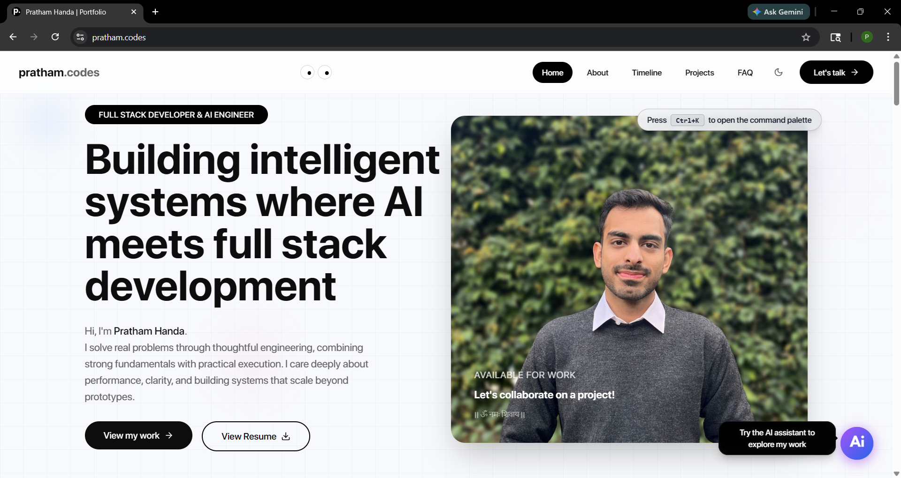
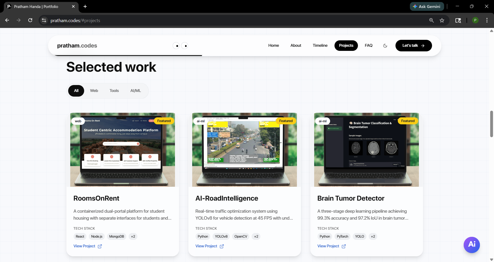
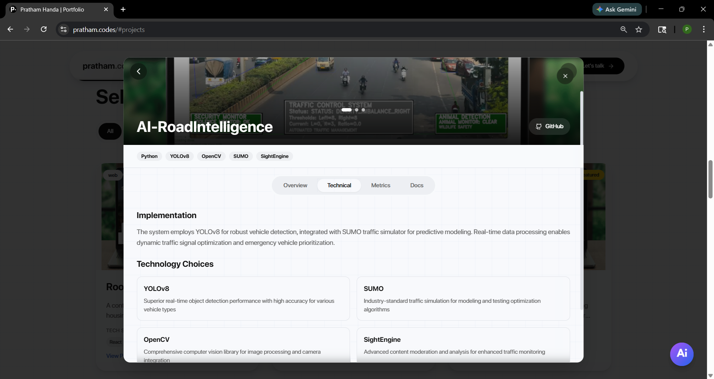
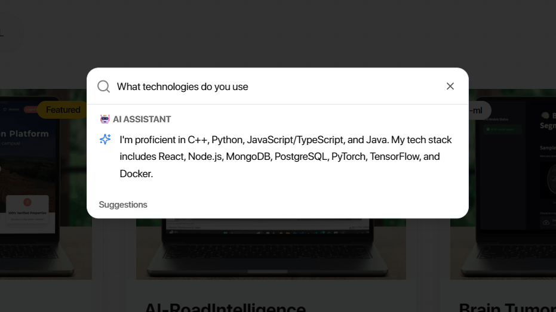
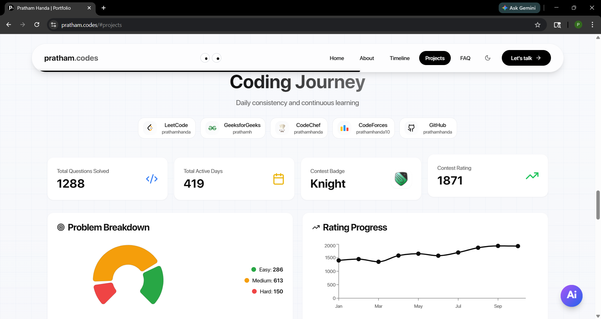
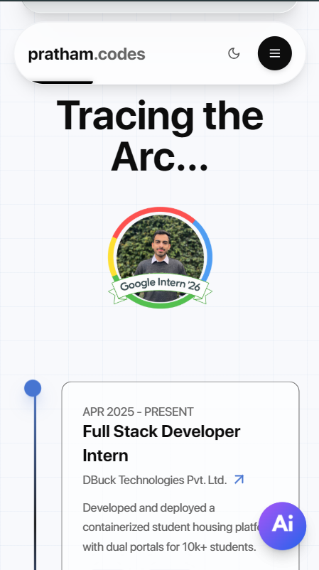

<div align="center">

#  Pratham Handa | Portfolio

<a href="https://pratham.codes">

</a>

### **AI-powered navigation. Performance-first UI. A portfolio that feels like a product.**

[](https://www.typescriptlang.org/)
[](https://react.dev/)
[](https://vitejs.dev/)
[](https://tailwindcss.com/)
[](https://vercel.com/)

<br />

[🚀 Quick Start](#-quick-start) • [✨ Highlights](#-feature-highlights) • [🖼️ Screenshots](#%EF%B8%8F-screenshots) • [🛠️ Tech Stack](#%EF%B8%8F-tech-stack) • [📖 Customization](#-customization)

<br />

</div>

## 🎯 What is this?

This is a modern, product-grade developer portfolio built with **React + Vite + TypeScript**, designed to showcase projects, experience, and live coding stats with a premium UX.

It’s optimized for **keyboard-first navigation**, **smooth scroll interactions**, and **fast perceived performance** (preloading, lightweight animations, and a clean component architecture).

---

## ✨ Feature Highlights

<table>
<tr>
<td width="50%">

### 🤖 AI Command Palette
- Natural language search (Google Gemini integration)
- Keyboard-first UX (**Ctrl+K**)
- Quick navigation across sections and content
- Mobile-friendly quick access (floating action button)

</td>
<td width="50%">

### 📊 Live Coding Dashboard
- Multi-platform stats (e.g. competitive programming + contributions)
- Cached & resilient fetching patterns
- Clean visualizations and quick glance widgets

</td>
</tr>
<tr>
<td width="50%">

### 🎨 Premium UI/UX
- Glassmorphism-inspired cards and layered backgrounds
- Dark/Light theme support
- Responsive layout with mobile-friendly interactions
- Animated SVG preloader experience

</td>
<td width="50%">

### ⚡ Performance-first Architecture
- Scroll-triggered reveals via IntersectionObserver
- Image preloading for key project thumbnails
- UI built from accessible primitives (Radix + shadcn)

</td>
</tr>
</table>

<table>
<tr>
<td align="center" width="33%">
<h3>⌨️</h3>
<b>Keyboard-first</b><br/>
<sub>Ctrl+K command palette • fast navigation</sub>
</td>
<td align="center" width="33%">
<h3>🧠</h3>
<b>AI Search</b><br/>
<sub>Gemini-powered answers • smart fallbacks</sub>
</td>
<td align="center" width="33%">
<h3>🌓</h3>
<b>Theme System</b><br/>
<sub>Light/Dark toggle • system-aware</sub>
</td>
</tr>
<tr>
<td align="center" width="33%">
<h3>🧩</h3>
<b>Project Deep Dives</b><br/>
<sub>Detail modal • gallery • tech stack</sub>
</td>
<td align="center" width="33%">
<h3>📈</h3>
<b>Live Stats</b><br/>
<sub>Coding dashboard • charts • snapshots</sub>
</td>
<td align="center" width="33%">
<h3>⚡</h3>
<b>Perceived Speed</b><br/>
<sub>Image preloading • scroll reveals</sub>
</td>
</tr>
</table>

---

## 🖼️ Screenshots

Add screenshots here to match the “product README” vibe. Recommended set:

- **Hero / Landing** (top of the page)
- **Projects grid** (with cards visible)
- **Project detail modal** (open on a project)
- **AI Command Palette** (opened with Ctrl+K)
- **Coding Dashboard** (stats + charts)
- **Mobile view** (any section + nav/fab)

<table>
   <tr>
      <td align="center" width="50%">
         
         <br />
         <sub><b>Hero</b> — first impression + headline</sub>
      </td>
      <td align="center" width="50%">
         
         <br />
         <sub><b>Projects</b> — curated work with rich cards</sub>
      </td>
   </tr>
   <tr>
      <td align="center" width="50%">
         
         <br />
         <sub><b>Project Modal</b> — full project story + gallery</sub>
      </td>
      <td align="center" width="50%">
         
         <br />
         <sub><b>Command Palette</b> — AI navigation with Ctrl+K</sub>
      </td>
   </tr>
   <tr>
      <td align="center" width="50%">
         
         <br />
         <sub><b>Coding Dashboard</b> — live stats and visuals</sub>
      </td>
      <td align="center" width="50%">
         
         <br />
         <sub><b>Mobile</b> — responsive layout + touch-friendly UX</sub>
      </td>
   </tr>
</table>

> Tip: your screenshots live in `public/ss/` — keep adding images there and update the filenames in this section.

---

## 🚀 Quick Start

```bash
# 1) Install deps
npm install

# 2) Configure env (optional but recommended for AI features)
# Create a .env file in the project root

# 3) Start dev server
npm run dev
```

Open http://localhost:8080

### 🔐 Environment Variables

Create `.env` in the project root:

```env
# Enables AI-powered command palette features
VITE_GEMINI_API_KEY=your_key_here
```

### Production

```bash
npm run build
npm run preview
```

---

## 🛠️ Tech Stack

**Frontend**
- React 18, TypeScript, Vite
- Tailwind CSS

**UI / UX**
- shadcn/ui + Radix UI primitives
- lucide-react icons
- next-themes for theme switching

**Data / Integrations**
- TanStack Query
- Google Gemini integration for AI search

**Deployment / Analytics**
- Vercel
- Vercel Analytics + Speed Insights

---

## 📖 Customization

Common update points:

- **Projects**: edit `src/data/projects.ts`
- **AI Context**: edit `src/lib/aiSearch.ts` (resume/context + fallback answers)
- **Branding / Theme tokens**: edit `src/index.css` (CSS variables + theme primitives)
- **Public assets**: swap images under `public/` (icons, project images, preloader SVG)

---

## 📬 Contact

**Pratham Handa**
- Portfolio: https://pratham.codes
- LinkedIn: https://www.linkedin.com/in/prathamh/
- GitHub: https://github.com/prathamhanda
- Email: prathamhanda10@gmail.com
- LeetCode: https://leetcode.com/u/prathamhanda/
<div align="center">

**⭐ If you found this portfolio inspiring, consider giving it a star!**

</div>
